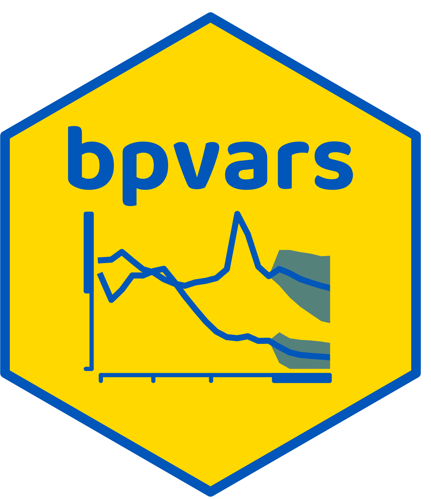

##  {background-color="#FFD800"}

{.absolute top=30 right=275 width="500"}

##  {background-color="#FFD800"}

$$ $$

### Structural Vector Autoregressions {style="color:#0056B9;"}

### Identification of Structural VARs {style="color:#0056B9;"}

### Dynamic Causal Effects {style="color:#0056B9;"}

### Bayesian Estimation {style="color:#0056B9;"}

### Monetary Policy Analysis Using the  [bsvars](https://cran.r-project.org/package=bsvars) Package {style="color:#0056B9;"}

##  {background-color="#FFD800"}

{.absolute top=30 right=200 width="800"}

